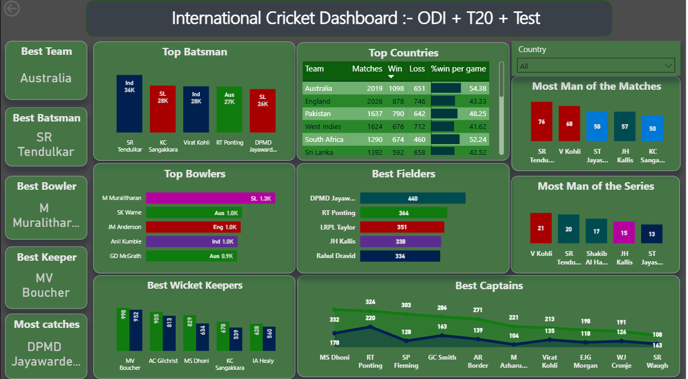

# 🏏 International Cricket Data Analytics Dashboard

### 📊 Web Scraping and End-to-End Data Visualization & Analysis Project on combined ODI, T20 & Test Cricket Statistics

---

## 🔍 Project Summary

This project presents a **comprehensive cricket analytics dashboard** that merges ODI, T20, and Test match statistics into a unified visualization. Built using **Python** (for data scraping & preprocessing) and **Power BI** (for visual storytelling), it answers critical questions about player performance, country dominance, and trends across decades.

Key questions addressed:

* 🏆 Who are the top performers across formats?
* 🌍 Which countries dominate international cricket?
* 📈 What are the performance trends over time?
* 🎯 Which captains, bowlers, and batsmen have had the biggest impact?

---

## ⚙️ Tech Stack

| Tool                 | Purpose                               |
| -------------------- | ------------------------------------- |
| **Python**           | Web scraping, data wrangling          |
| **BeautifulSoup**    | Extracting data from web pages        |
| **Pandas, NumPy**    | Cleaning, transformation, aggregation |
| **Jupyter Notebook** | EDA and preprocessing                 |
| **Power BI**         | Dashboard creation and modeling       |

---

## 🌐 Web Scraping

### 📍 Sources:

* **ESPNcricinfo** – Player and country stats
* **Cricwindow\.com** – Historical data on captains, keepers, match awards, etc.

### 📂 Script:

📄 `Web Scrapping for cricket data.ipynb`

### 🧹 Data Collected:

| Data Type              | Source       | Details                               |
| ---------------------- | ------------ | ------------------------------------- |
| 🏏 Most Runs           | ESPNcricinfo | Player, Matches, Runs, Start–End Year |
| 🎯 Most Wickets        | ESPNcricinfo | Wickets, Matches                      |
| 🧤 Most Catches        | Cricwindow   | Fielder Name, Dismissals              |
| 🧢 Match Awards        | Cricwindow   | MoM & MoS data                        |
| 🧑‍✈️ Captain Stats    | Cricwindow   | Matches, Wins, Losses, Win %          |
| 🌍 Country Performance | ESPNcricinfo | Matches, Wins, Losses, Win rate       |

**Tech Used:** `requests`, `BeautifulSoup`, `pandas`

> ✅ Special logic was written to clean raw scraped strings like "1.2K", "10K", "234M" into numeric values.

---

## 🧪 Exploratory Data Analysis (EDA)

📄 `Exploratory Data Analysis on Cricket data.ipynb`

### ✅ Key Tasks:

* Converted strings like `'1.3K'`, `'1M'` → integers
* Extracted **StartYear** and **EndYear** for all players
* Created `combined_odi_t20_test_stats.xlsx` file with merged data
* Ensured data consistency across formats and metrics

---

## 📊 Power BI Dashboard

📄 `Cricket data Visualisation.pbix`

### 🔍 Dashboard Preview:


### 🎯 Dashboard Highlights:

| Visual Tile           | Description                       |
| --------------------- | --------------------------------- |
| **Top Batsman**       | Most international runs           |
| **Top Bowlers**       | Leading wicket-takers             |
| **Best Keepers**      | Dismissals by wicket-keepers      |
| **Best Fielders**     | Most catches                      |
| **Top Captains**      | Matches led, wins                 |
| **Man of the Match**  | Top award winners                 |
| **Man of the Series** | Series performance highlights     |
| **Top Countries**     | Country-level wins, losses, win % |

---

## 🧭 Filters & Time Slicer

* ✅ **Country Filter**: Slice stats by selected country
* 🕒 **(Coming Soon)**: A unified **Year Slicer** via `YearTable = GENERATESERIES(1980, 2025, 1)`

  * You’ll be able to filter all visuals by specific year or range

---

## 📂 Project Structure

```
Cricket-Analysis/
│
├── Dataset/
│   └── combined_odi_t20_test_stats.xlsx       # Final unified dataset
│
├── Python Scripting/
│   ├── Web Scrapping for cricket data.ipynb   # Web scraping logic
│   └── Exploratory Data Analysis on Cricket data.ipynb
│
├── Visualisation/
│   ├── Cricket data Visualisation.pbix        # Power BI dashboard
│   └── dashboard_screenshot.png
│
└── README.md
```

---

## 🚀 How to Run Locally

1. **Clone the repo**
2. Run `Web Scrapping for cricket data.ipynb` to refresh data (optional)
3. Open `Exploratory Data Analysis...ipynb` to preprocess
4. Load `Cricket data Visualisation.pbix` in Power BI Desktop
5. Interact with the dashboard

---
## 🧠 Key Learnings

* 🔗 Complex relationship modeling in Power BI
* 🧹 Transforming scraped text like "1.2K" or "1M"
* 📊 Using DAX to normalize metrics like Runs/Year
* 📈 Creating meaningful dashboards for storytelling

---

## 📸 Dashboard Preview



